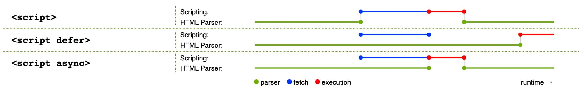

# javascript加载

网页中的javascript加载分为以下三种方式：

1. 内部javascript
2. 外部javascript
3. 内联javascript

## 内部javascript

写在html元素的`head`标签对内部的javascript代码称为内部javascript。如下示例：

```html
<!DOCTYPE html>
<html lang="en">
<head>
	<meta charset="UTF-8">
	<meta http-equiv="X-UA-Compatible" content="IE=edge">
	<meta name="viewport" content="width=device-width, initial-scale=1.0">
	<title>Document</title>
	<script>
        // 因为要操作dom元素，因此js脚本依赖于dom加载完成
		document.addEventListener('DOMContentLoaded', () => {
			function createParagraph() {
				const para = document.createElement("p");
				document.body.appendChild(para);
			}

			const buttons = document.querySelectorAll("button");

			for (const button of buttons) {
				button.addEventListener("click", createParagraph);
			}						
		})
	</script>
</head>
<body>
	<button>点击新增新段落</button>
</body>
</html>
```

> 点击按钮html文档下方将会添加一个新段落。

## 外部javascript

将javascript代码单独写到后缀为.js的文件中，通过`script`标签以属性`src`方式引入。

假设有以下内容的`script.js`文件：

```javascript
function createParagraph() {
  const para = document.createElement("p");
  para.textContent = "你点击了按钮！";
  document.body.appendChild(para);
}

const buttons = document.querySelectorAll("button");

for (const button of buttons) {
  button.addEventListener("click", createParagraph);
}
```

在html的`head`标签中以`script`标签引入script.js脚本
```html
<!DOCTYPE html>
<html lang="en">
<head>
	<meta charset="UTF-8">
	<meta http-equiv="X-UA-Compatible" content="IE=edge">
	<meta name="viewport" content="width=device-width, initial-scale=1.0">
	<title>Document</title>
    <script src="script.js" defer></script>
</head>
<body>
	<button>点击新增新段落</button>
</body>
</html>
```

> 注意到 `defer属性`。defer属性会等到dom文档加载完成之后，按照js声明顺序执行脚本，能够保证js正常执行

## 内联javascript

有时候在html文档元素中，依赖了script中声明的函数。如下：

```javascript
function createParagraph() {
  const para = document.createElement("p");
  para.textContent = "你点击了按钮！";
  document.body.appendChild(para);
}
```

```html
<button onclick="createParagraph()">点我！</button>
```

> 请不要这样子使用！！！因为这使得JavaScript 污染了 HTML，而且效率低下。对于每个需要应用 JavaScript 的按钮，你都得手动添加 onclick="createParagraph()" 属性。

## 脚本调用策略

要让脚本调用的时机符合预期，需要解决一系列的问题。最常见的问题就是：HTML 元素是按其在页面中出现的次序调用的，如果用 JavaScript 来管理页面上的文档对象模型，若 JavaScript 加载于欲操作的 HTML 元素之前，则代码将出错。

在上文的“内部”、“外部”示例中，JavaScript 在文档头部，解析 HTML 文档体之前加载并执行。这样做是有隐患的，需要使用一些结构来避免错误发生。

“内部”示例中，通过监听浏览器的 `DOMContentLoaded` 事件，其标志了 HTML 文档体完全加载和解析。该代码块中的 JavaScript 在事件被触发后才会运行，因此避免了错误。

“外部”示例中使用了 JavaScript 的一项现代技术（defer 属性）来解决这一问题，它告知浏览器在遇到 `<script>`元素时继续下载 HTML 内容。

> 在外部示例中，不需要使用 DOMContentLoaded 事件，因为 defer 属性为我们解决了这个问题。我们没有在内部 JavaScript 示例中使用 defer 解决方案，因为 <font style="color: red">defer 只适用于外部脚本。</font>

解决此问题的旧方法是：把脚本元素放在文档体的底端，这样脚本就可以在 HTML 解析完毕后加载了。此方案的问题是：只有在所有 HTML DOM 加载完成后才开始脚本的加载/解析过程。对于有大量 JavaScript 代码的大型网站，可能会带来显著的性能损耗。

<font style="color: red">脚本阻塞实际有2中解决方案： async 和 defer</font>

浏览器遇到 async 脚本时不会阻塞页面渲染，而是直接下载然后运行。但是，一旦下载完成，脚本就会执行，从而阻止页面渲染。<font style="color: red">脚本的运行次序无法控制。当页面的脚本之间彼此独立，且不依赖于本页面的其他任何脚本时，async 是最理想的选择。</font>

使用 <font style="color: red">defer 属性加载的脚本将按照它们在页面上出现的顺序加载。在页面内容全部加载完毕之前，脚本不会运行，如果脚本依赖于 DOM 的存在（例如，脚本修改了页面上的一个或多个元素），这一点非常有用。</font>

脚本加载方式可视化图解：



<b style="color: red">脚本调用策略小结：</b>
1. async 和 defer 都指示浏览器在一个单独的线程中下载脚本，而页面的其他部分（DOM 等）正在下载，因此在获取过程中页面加载不会被阻塞。
2. async 属性的脚本将在下载完成后立即执行。这将阻塞页面，并不保证任何特定的执行顺序。
3. 带有 defer 属性的脚本将按照它们的顺序加载，并且只有在所有脚本加载完毕后才会执行。
4. 如果脚本无需等待页面解析，且无依赖独立运行，那么应使用 async。
5. 如果脚本需要等待页面解析，且依赖于其他脚本，调用这些脚本时应使用 defer，将关联的脚本按所需顺序置于 HTML 的相应 <script> 元素中。