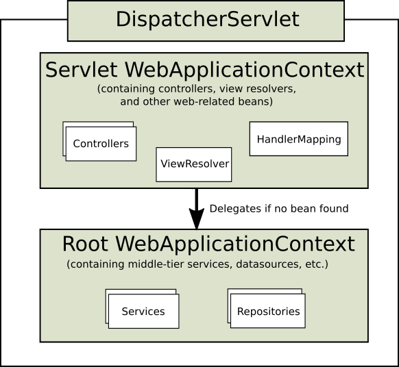

# 概述

Spring MVC，全称Spring Web MVC，是一种基于ServletAPI的轻量级Web框架，实现了MVC（Model-View-Controller）设计模型。它是Spring框架的一部分，特别是作为Spring Framework后续产品的一部分。

Spring MVC的特点包括清晰的角色划分、灵活的配置功能、提供了大量的控制器接口和实现类，以及真正做到了与View层的实现无关（如JSP、Velocity、Xslt等）。此外，它还支持国际化，并采用了面向接口编程的方式。Spring MVC简化了Web开发，提供了Web应用开发的一整套流程，使得开发者可以更加高效地进行Web开发。

简而言之，Spring MVC是一种强大且灵活的Web框架，它基于MVC设计模式，通过将Web层进行解耦，使得开发者可以更加专注于业务逻辑的实现，提高了开发效率和代码质量。

## DispatchServlet

和其他web框架类似，Spring MVC围绕一个叫做 `DispatchServlet` 的Servlet的前端控制器进行设计，该Servlet为请求处理提供了一个共享的算法，而<font style="color: red">实际的工作则是由可配置的代理组件来完成的</font>。这种模型非常灵活，支持多种工作流程。

下面是基于 Java的配置注册和初始化 DispatcherServlet 的示例，它由 Servlet 容器自动检测:

```java
public class ServletConfig implements WebApplicationInitializer {

  @Override
  public void onStartup(ServletContext servletContext) throws ServletException {
    // 创建web上下文，可以选择 WebApplicationContext实现
    AnnotationConfigWebApplicationContext context = new AnnotationConfigWebApplicationContext();
    // 注册配置类，该配置类主要创建spring mvc组件，作用与 spring-web.xml类似
    context.register(SpringWebMvcConfigBean.class);
    // 创建 DispatchServlet前端控制器，用于监听用户请求
    DispatcherServlet dispatcherServlet = new DispatcherServlet(context);
    // 注册servlet（该特性由Servlet3.0及以后支持）
    ServletRegistration.Dynamic registration = servletContext.addServlet("dispatchServlet", dispatcherServlet);
    registration.setLoadOnStartup(1);
    registration.addMapping("/");
  }
}
```

`WebApplicationInitializer`是Spring提供的一个接口，用于配置Servlet 3.0以后的配置，<font style="color: red">其主要目的是替代传统的web.xml文件的作用</font>，实现这个接口的类会自动被SpringServletContainerInitializer获取到。

> 在Servlet3.0规范中，引入了一种新机制，称为Servlet容器初始化器（Servlet Container Initializer, SCI）。这种机制允许开发者通过Java SPI机制提供自定义的Servlet容器初始化器以替代传统的web.xml配置方式

**<font style="color: red">Spring MVC通过SPI机制自动发现WebApplicationInitializer</font>**

SPI机制是一种服务发现机制，Spring MVC实现该机制分为以下步骤：

1. Servlet容器提供了服务发现接口：`ServletContainerInitializer`，该接口由Spring MVC实现，该实现类是：`SpringServletContainerInitializer`，其声明如下：
```java
@HandlesTypes(WebApplicationInitializer.class)
public class SpringServletContainerInitializer implements ServletContainerInitializer {

	@Override
	public void onStartup(@Nullable Set<Class<?>> webAppInitializerClasses, ServletContext servletContext)
			throws ServletException {

		List<WebApplicationInitializer> initializers = Collections.emptyList();

		if (webAppInitializerClasses != null) {
			initializers = new ArrayList<>(webAppInitializerClasses.size());
			for (Class<?> waiClass : webAppInitializerClasses) {
				// 如果类类型不是接口并且不是抽象类，同时与WebApplicationInitializer是相同类型，则注册并实例化
				if (!waiClass.isInterface() && !Modifier.isAbstract(waiClass.getModifiers()) &&
						WebApplicationInitializer.class.isAssignableFrom(waiClass)) {
					try {
						initializers.add((WebApplicationInitializer)
								ReflectionUtils.accessibleConstructor(waiClass).newInstance());
					}
					catch (Throwable ex) {
						throw new ServletException("Failed to instantiate WebApplicationInitializer class", ex);
					}
				}
			}
		}

        // 如果没有找到合适的 WebApplicationInitializer 给出提示并返回
		if (initializers.isEmpty()) {
			servletContext.log("No Spring WebApplicationInitializer types detected on classpath");
			return;
		}

		servletContext.log(initializers.size() + " Spring WebApplicationInitializers detected on classpath");

        // 根据声明的顺序，依次调用 onStartup 方法进行启动初始化工作
		AnnotationAwareOrderComparator.sort(initializers);
		for (WebApplicationInitializer initializer : initializers) {
			initializer.onStartup(servletContext);
		}
	}
}
```

2. 在META-INF/services目录下注册服务实现：SPI机制通过扫描META-INF/services目录下的配置文件来发现服务实现。对于ServletContainerInitializer，有一个名为javax.servlet.ServletContainerInitializer的文件，文件中列出了所有ServletContainerInitializer实现类的全限定名。

> 注意到 `SpringServletContainerInitializer`接口上有一个注解`@HandlesTypes(WebApplicationInitializer.class)`声明，该注解由javax所提供，在Servlet容器启动时，会在类路径查找指定类型的实现类类型，上述接口中将找到的实现类类型传递给`webAppInitializerClasses`参数。存在多个类型可以通过Ordered接口声明初始化顺序。

下面是基于 web.xml的注册和配置 DispatcherServlet：

```xml
<web-app>

    <!--应用启动监听器-->
    <listener>
        <listener-class>
            org.springframework.web.context.ContextLoaderListener
        </listener-class>
    </listener>

    <!--应用配置文件路径（根容器）-->
    <context-param>
        <param-name>contextConfigLocation</param-name>
        <param-value>/WEB-INF/app-context.xml</param-value>
    </context-param>

    <!--DispatcherServlet前端控制器注册-->
    <servlet>
        <servlet-name>dispatcherServlet</servlet-name>
        <servlet-class>
            org.springframework.web.servlet.DispatcherServlet
        </servlet-class>
        <init-param>
            <!--与该DispatcherServlet控制器关联的spring 组件配置文件-->
            <param-name>contextConfigLocation</param-name>
            <!--
                必须配置这个参数，但是值可以不配置，如果不配置该参数，会有一个默认值，可能
                可能导致配置文件找不到
            -->
            <param-value></param-value>
        </init-param>
        <load-on-startup>1</load-on-startup>
    </servlet>

    <!--前端控制器映射-->
    <servlet-mapping>
        <servlet-name>dispatcherServlet</servlet-name>
        <url-pattern>/</url-pattern>
    </servlet-mapping>

</web-app>
```

> 注意：上述基于web.xml的配置文件中，注册了名为`ContextLoaderListener`的监听器，它是一个`ServletContextListener`，其主要作用是在Web应用程序加载时启动Spring容器。具体来说，ContextLoaderListener在Web应用程序启动时负责创建ApplicationContext对象，并将其存储在ServletContext中。进而其他组件（如控制器、过滤器等）就可以通过ServletContext获取ApplicationContext，从而访问Spring的功能。<font style="color: red; font-weight: bolder">ContextLoaderListener还负责初始化和销毁ApplicationContext。它在Web应用程序启动时调用ApplicationContext的refresh()方法进行初始化。此外，ContextLoaderListener的主要作用还包括读取在contextConfigLocation中定义的xml文件，自动装配ApplicationContext的配置信息，并产生WebApplicationContext对象。然后，它将这个对象放置在ServletContext的属性里，以便其他组件可以通过ServletContext获取并使用这个对象，从而利用Spring容器管理的bean。ContextLoaderListener在Spring MVC中扮演着至关重要的角色，它确保了Spring容器的正确初始化和配置，使得其他组件能够顺利地访问和使用Spring的功能。</font>

> 感兴趣可以参考ContextLoaderListener父类 ContextLoader初始化源码！！！

### 应用上下文层次结构

DispatcherServlet需要一个特定的上下文环境（`WebApplicationContext`）来配置自己，WebApplicationContext是ApplicationContext的一个扩展，它除了拥有ApplicationContext的所有功能外，还与ServletContext和与其关联的Servlet有链接。WebApplicationContext被绑定到ServletContext，这意味着应用程序可以使用`RequestContextUtils`的静态方法来查找WebApplicationContext。例如，可以使用RequestContextUtils.findWebApplicationContext(request)来获取当前的WebApplicationContext。

> `RequestContextUtils`是Spring框架提供的一个工具类，它<font style="color: red">主要用于从HttpServletRequest上下文中获取特定的对象。这些对象可能包括`WebApplicationContext`、`LocaleResolver`、`Locale`、`ThemeResolver`、`Theme`以及`MultipartResolver`等。</font>更多参考javadoc文档。

<font style="color: red">对于多数应用程序来说，拥有一个单独的 WebApplicationContext 是足够的。此外，还可以配置一个有层次结构的上下文，其中一个根 WebApplicationContext 在多个 DispatcherServlet (或其他 Servlet)实例之间共享，每个实例都有自己的子 WebApplicationContext 配置。</font>

根 WebApplicationContext 通常包含基础设施 bean，例如需要跨多个 Servlet 实例共享的数据存储库（Dao）和业务服务(Service)。这些 bean 被有效地继承，并且可以在 Servlet 特定的子 WebApplicationContext 中重写(即重新声明) ，该子 WebApplicationContext 通常包含给定 Servlet 的本地 bean。下图显示了这种关系:



> 特定的子容器获取不到，可以从根容器获取需要的组件（bean）

下面示例配置了一个有层次结构的上下文：

```java
public class MvcConfig extends AbstractAnnotationConfigDispatcherServletInitializer {

  // 配置根容器配置类，该配置类就是一个基于注解配置的根容器
  @Override
  protected Class<?>[] getRootConfigClasses() {
    return new Class[]{RootWebApplicationConfig.class};
  }

  // 配置子容器配置类，该配置类是一个基于注解配置的spring mvc配置容器
  @Override
  protected Class<?>[] getServletConfigClasses() {
    return new Class[]{DispatcherServletConfig.class};
  }

  // 配置DispatcherServlet映射
  @Override
  protected String[] getServletMappings() {
    return new String[]{"/"};
  }
}
```

> <font style="color: red">如果不需要层次结构上下文，可以将子容器配置类（getServletConfigClasses）返回null即可，只保留根容器！</font>

上面基于注解配置的层次接口上下文可以采用下面的方式基于xml配置：

```xml
<web-app>
    <listener>
        <listener-class>org.springframework.web.context.ContextLoaderListener</listener-class>
    </listener>

    <context-param>
        <param-name>contextConfigLocation</param-name>
        <!--指定跟容器的spring配置文件，默认实现是 XmlWebApplicationContext-->
        <param-value>/WEB-INF/root-context.xml</param-value>
    </context-param>

    <servlet>
        <servlet-name>dispatcherServlet</servlet-name>
        <servlet-class>org.springframework.web.servlet.DispatcherServlet</servlet-class>
        <init-param>
            <param-name>contextConfigLocation</param-name>
            <!--指定子容器的spring配置文件，默认实现是 XmlWebApplicationContext-->
            <param-value>/WEB-INF/dispatcherServlet.xml</param-value>
        </init-param>
        <load-on-startup>1</load-on-startup>
    </servlet>

    <!--DispatcherServlet拦截路径-->
    <servlet-mapping>
        <servlet-name>dispatcherServlet</servlet-name>
        <url-pattern>/</url-pattern>
    </servlet-mapping>
</web-app>
```
> <font style="color: red">同样，如果不需要子容器，将DispatcherServlet的contextConfigLocation参数设置为空，不能省略!!!</font>

除了上述可以通过`AbstractAnnotationConfigDispatcherServletInitializer`自定义层次上下文，还可以继承其父类`AbstractDispatcherServletInitializer`配置层次上下文，如下示例：

```java
public class MvcConfigV2 extends AbstractDispatcherServletInitializer {

  // 配置子容器，创建WebApplicationContext类型容器
  @Override
  protected WebApplicationContext createServletApplicationContext() {
    XmlWebApplicationContext context = new XmlWebApplicationContext();
    // 在 spring配置文件中定义web组件
    context.setConfigLocation("/WEB-INF/dispatcherServlet.xml");
    return context;
  }

  // 配置DispatcherServlet映射
  @Override
  protected String[] getServletMappings() {
    return new String[]{"/"};
  }

  // 创建根容器，创建WebApplicationContext类型容器
  @Override
  protected WebApplicationContext createRootApplicationContext() {
    XmlWebApplicationContext context = new XmlWebApplicationContext();
    // 在spring配置文件中定义公共组件
    context.setConfigLocation("/WEB-INF/application.xml");
    return context;
  }
}
```

> <font style="color: red">注意，当只配置一个容器时，容器的类型必须是WebApplicationContext类型，因为web模块中的Controller(控制器)只有在web上下文才会被扫描。</font>，示例如下：

```java
/**
 * 只配置根容器，特定的DispatcherServlet子容器返回null
 */
public class MvcConfig extends AbstractAnnotationConfigDispatcherServletInitializer {

  @Override
  protected Class<?>[] getRootConfigClasses() {
    return new Class[]{RootWebApplicationConfig.class};
  }

  // 子容器返回null
  @Override
  protected Class<?>[] getServletConfigClasses() {
    return null;
  }

  @Override
  protected String[] getServletMappings() {
    return new String[]{"/"};
  }
}
```

```java
@ComponentScan("cn.chiatso.mvc")
@Configuration
@EnableWebMvc
// 由于只配置根容器，不会扫描Controller，因此实现接口 `WebMvcConfigurer` 并开启WebMvc配置
public class RootWebApplicationConfig implements WebMvcConfigurer {
}
```

### Spring MVC中特殊类型Bean

DispatcherServlet 委托“特殊的bean” 来处理请求并呈现适当的响应。这里的“特殊 bean”是指实现框架契约的 Spring 管理的 bean 实例，这些内置特殊bean可以通过配置自定义扩展。Spring MVC内置的特殊bean有以下：

+ HandlerMapping：<font style="color: red">在Spring MVC中，HandlerMapping的作用是将请求映射到处理器以及与之相关的拦截器列表中，具体因HandlerMapping实现不同有差异。其主要职责是解析Http请求，并将其映射到处理器（Controller定义的方法），该映射过程可以包括一些前置和后置处理的拦截器，用于在处理请求的不同阶段执行额外逻辑。</font>
> Spring MVC提供了2中HandlerMapping的实现，分别是：`RequestMappingHandlerMapping` 和 `SimpleUrlHandlerMapping`。它们之间的差异如下：
> 1. RequestMappingHandlerMapping：<font style="color: red">支持使用 `@RequestMapping`注解将请求映射到方法，基于注解自动发现和处理映射关系，无需在配置文件申明映射关系，并且它会自动检测带有 `Controller` 和 `RestController`注解类，并将其方法映射到响应的URL</font>，此外 RequestMappingHandlerMapping 还可以与接口 HandlerInterceptor 实现一起工作，以定义前置或后置拦截器用于处理请求不同阶段的额外逻辑。 
> 2. SimpleUrlHandlerMapping：<font style="color: red">用于显式地在配置中定义URL路径到处理器的映射关系，通常通过XML配置文件来定义映射规则，它不支持基于注解的自动映射</font>。SimpleUrlHandlerMapping适用于简单的URL映射场景，或者当开发者想要完全控制映射逻辑时。同样，它也可以与HandlerInterceptor接口的实现类一起使用，以定义前置和后置拦截器。
在配置HandlerMapping时，可以定义一系列拦截器，这些拦截器将在请求处理的不同阶段被调用。

+ HandlerAdapter：<font style="color: red">HandlerAdapter的主要职责是帮助DispatcherServlet调用与请求映射的处理器。</font>HandlerAdapter提供了一个通用的接口，使得DispatcherServlet不需要知道处理器是如何被实际调用的。这有助于解耦DispatcherServlet和处理器之间的关系，使得DispatcherServlet可以专注于请求的分发，而HandlerAdapter负责处理请求的实际执行。

+ HandlerExceptionResolver：<font style="color: red">异常解析器，主要负责识别异常，提供响应以及自定义异常处理。</font>Spring MVC提供的默认实现有 `ExceptionHandlerExceptionResolver` （用于处理使用@ExceptionHandler注解的方法）和 `ResponseStatusExceptionResolver`（用于处理带有 @ResponseStatus 注解的异常）和 `DefaultHandlerExceptionResolver`（用于处理标准的 Spring MVC 异常）

+ ViewResolver：<font style="color: red">视图解析器，负责将逻辑视图名称转换为具体的视图实现</font>，如JSP、Thymeleaf模板等。视图解析器通常通过实现ViewResolver接口来定义，该接口包含一个方法resolveViewName，它接收一个视图名称（通常是一个字符串），并返回一个View对象。Spring MVC提供了几个默认的视图解析器实现，如InternalResourceViewResolver（用于解析JSP视图）和ThymeleafViewResolver（用于解析Thymeleaf模板）。

+ LocaleResolver, LocaleContextResolver：在Spring MVC中，<font style="color: red">LocaleResolver 和 LocaleContextResolver 接口都与国际化（i18n）和本地化（l10n）相关，它们负责确定用户的区域设置（locale），以便在Web应用程序中提供适当的本地化内容</font>。
> LocaleResolver：<font style="color: red">它负责解析HTTP请求中的区域设置信息，并将这些信息存储在LocaleContextHolder中，以便在应用程序的后续请求处理过程中使用。LocaleResolver 的实现通常会在每次请求时根据请求头中的信息（如Accept-Language）来解析出用户的区域设置。</font>Spring MVC提供了以下LocaleResolver实现：
> + FixedLocaleResolver：使用固定的区域设置；
> + AcceptHeaderLocaleResolver：根据HTTP请求头的Accept-Language来解析区域设置；
> + CookieLocaleResolver：从客户端的cookie中读取区域设置信息；
> + SessionLocaleResolver：从用户的session中读取区域设置信息。
> 
> LocaleContextResolver：是Spring 3.1之后引入的一个更通用的接口，扩展了LocaleResolver接口，<font style="color: red">不仅解析Locale，还解析TimeZone等其他与区域相关的上下文信息。</font>
LocaleContextResolver的实现通常也会根据请求中的信息来解析区域上下文，并将其存储在LocaleContextHolder中。LocaleContextHolder是一个线程局部存储，它存储了当前线程（即当前请求）的区域上下文信息。LocaleContextResolver的一个常见实现是FixedLocaleContextResolver，它类似于FixedLocaleResolver，但提供了更多的上下文信息。

+ ThemeResolver：<font style="color: red">用于解析和管理用户的主题设置。</font>主题通常指的是应用程序的整体样式和风格，包括 CSS 样式、图片和其他静态资源。通过 ThemeResolver，Spring MVC 允许开发者根据用户的请求或偏好动态地切换应用程序的主题。
> 在 Spring MVC 中，主题通常与一组静态资源相关联，这些资源被打包在一个或多个主题属性文件（通常是 .properties 文件）中。这些属性文件包含了主题的名称以及该主题所使用的资源路径。ThemeResolver 的主要作用是根据请求的上下文信息（如用户的会话、请求参数等）来确定应该使用哪个主题。一旦确定了主题，ThemeResolver 就会将这些资源路径提供给 ThemeSource，后者负责加载和提供这些资源。Spring MVC 提供了几种内置的 ThemeResolver 实现：
> + FixedThemeResolver：始终使用固定的主题，不会根据请求上下文进行变化。
> + SessionThemeResolver：根据用户的会话信息来确定主题。通常，主题名称会作为会话属性存储。
> + CookieThemeResolver：根据用户的 Cookie 信息来确定主题。主题名称被存储在 Cookie 中。
> 主题可以通过实现 `ThemeResolver`接口自定义

+ MultipartResolver：<font style="color: red">用于处理文件上传的组件。它是Spring对文件上传处理流程在接口层次的抽象。当接收到类型为multipart/form-data的请求时，MultipartResolver会解析这个请求，将文件数据解析成MultipartFile对象，并将其封装在MultipartHttpServletRequest对象中。Spring MVC提供了内置实现`CommonsMultipartResolver。</font>

+ FlashMapManager：<font style="color: red">FlashMapManager是Spring MVC框架中的一个组件，用于管理FlashMap。</font>FlashMap主要用于在页面重定向（redirect）时传递参数。
> <font style="color: red">FlashMap就是一个特殊的Map，用于保存需要传递的数据，并且这些数据只在重定向过程中有效。一旦重定向完成，这些数据就会被自动删除。FlashMapManager的主要职责是创建、保存和检索FlashMap对象。当需要在重定向前设置一些信息，并在重定向后获取这些信息时，就可以使用FlashMapManager来实现。在重定向之前，将数据放入FlashMap中，并通过FlashMapManager将其保存。在重定向之后，再通过FlashMapManager从session中找到对应的FlashMap，从而获取到之前保存的数据。</font>需要注意的是，FlashMap中的数据是存储在session中的，因此在使用时需要谨慎处理，避免因为大量存储而导致session溢出。同时，由于FlashMap只在重定向过程中有效，所以在使用完毕后应该及时清理，以避免不必要的资源浪费。

### Web MVC配置

Web应用程序可以声明处理请求所需的“特殊的bean”组件用于处理请求，DispatcherServlet会检查WebApplication中每一个“特殊bean组件（前一节提到）”，如果没有找到，则会从`DispatcherServlet.properties`加载并创建组件处理请求。

在大多数情况下，MVC 配置是最好的起点。它用 Java 或 XML 声明所需的 bean，并提供一个更高级的配置回调 API 来定制它。

> SpringBoot 依赖于 MVCJava 配置来配置 SpringMVC，并提供了许多额外的便利选项。

### Servlet配置

在 Servlet 3.0及以后环境中，可以以编程方式配置 Servlet 容器，作为替代方案或与 web.xml 文件组合使用。下面的示例注册一个 DispatcherServlet:

```java
public class MyWebApplicationInitializer implements WebApplicationInitializer {

    /** 
     * 依赖于 Servelt容器的SPI机制自动发现 SpringServletContainerInitializer，并将扫描到的
     * WebApplicationInitializer实现作为类对象创建调用其 onStartup方法
     */
    @Override
    public void onStartup(ServletContext container) {
        // 创建XmlWebApplicationContext
        XmlWebApplicationContext appContext = new XmlWebApplicationContext();
        // spring web配置文件路径
        appContext.setConfigLocation("/WEB-INF/spring/dispatcher-config.xml");

        // 注册 DispatcherServlet以及映射
        ServletRegistration.Dynamic registration = container.addServlet("dispatcher", new DispatcherServlet(appContext));
        registration.setLoadOnStartup(1);
        registration.addMapping("/");
    }
}
```

`WebApplicationInitializer` 是 Spring MVC 提供的一个接口，它确保检测到您的实现并自动用于初始化任何 Servlet3容器。WebApplicationInitializer 的抽象基类实现 `AbstractDispatcherServletInitializer` 通过覆盖指定 servlet 映射和 DispatcherServlet 配置位置的方法，使注册 DispatcherServlet 变得更加容易。对于使用基于 Java 的 Spring 配置的应用程序，建议如下配置:

```java
public class MyWebAppInitializer extends AbstractAnnotationConfigDispatcherServletInitializer {

    // 返回根容器配置类
    @Override
    protected Class<?>[] getRootConfigClasses() {
        return null;
    }

    // 返回子容器配置类
    @Override
    protected Class<?>[] getServletConfigClasses() {
        return new Class<?>[] { MyWebConfig.class };
    }

    // 映射DispatcherServlet
    @Override
    protected String[] getServletMappings() {
        return new String[] { "/" };
    }
}
```

如果使用基于 XML 的 Spring 配置，应该直接从 AbstractDispatcherServletInitializer 进行扩展，如下面的示例所示:

```java
public class MyWebAppInitializer extends AbstractDispatcherServletInitializer {

    // 创建父容器
    @Override
    protected WebApplicationContext createRootApplicationContext() {
        return null;
    }

    // 创建子容器
    @Override
    protected WebApplicationContext createServletApplicationContext() {
        XmlWebApplicationContext cxt = new XmlWebApplicationContext();
        cxt.setConfigLocation("/WEB-INF/spring/dispatcher-config.xml");
        return cxt;
    }

    // 映射DispatcherServlet
    @Override
    protected String[] getServletMappings() {
        return new String[] { "/" };
    }
}
```

AbstractDispatcherServletInitializer 还提供了一种方便的方法来添加 Filter 实例，并将它们自动映射到 DispatcherServlet，如下面的示例所示:

```java
public class MyWebAppInitializer extends AbstractDispatcherServletInitializer {

    // ...

    // 添加过滤器
    @Override
    protected Filter[] getServletFilters() {
        return new Filter[] {
            new HiddenHttpMethodFilter(), new CharacterEncodingFilter() };
    }
}
```

每个过滤器都根据其具体类型添加一个默认名称，并自动映射到 DispatcherServlet。AbstractDispatcherServletInitializer 的 isAsyncSupport 方法提供了一个单独的位置，以便在 DispatcherServlet 和映射到它的所有过滤器上启用异步支持。默认情况下，此标志设置为 true。

最后，如果需要进一步自定义 DispatcherServlet 本身，可以重写 createDispatcherServlet 方法。

### DispatcherServlet处理流程

DispatcherServlet处理请求按照如下步骤进行：

+ 在请求中搜索 WebApplicationContext 上下文并将其绑定到请求作用域，以便控制器和流程中的其他元素使用。默认情况下，WebApplicationContext绑定在key为 `DispatcherServlet.WEB_APPLICATION_CONTEXT_ATTRIBUTE`的请求作用域下

+ 将区域设置解析器（LocaleResolver）绑定到请求，让流程中的元素在处理请求(呈现视图、准备数据等)时解析要使用的区域设置。如果不需要区域设置解析器，则不需要区域设置解析器。默认情况下绑定在key为`DispatcherServlet.LOCALE_RESOLVER_ATTRIBUTE`的请求作用域

+ 将主题解析器（ThemeResolver）绑定到请求，让视图等元素确定使用具体主题。如果不使用主题，则可以忽略它。默认情况下，将主题解析器绑定在key为`DispatcherServlet.THEME_RESOLVER_ATTRIBUTE`的请求作用域

+ 如果指定了文件上传文件解析器（MultipartResolver），则将检查请求是否是文件上传请求。若是则将请求包装在 `MultipartHttpServletRequest`

+ 查询适当的处理程序。如果找到处理程序，则运行与处理程序(预处理程序、后处理程序和控制器)关联的执行链，以准备呈现模型。

+ 如果返回模型，则呈现视图。如果没有返回任何模型(可能是由于预处理器或后处理器拦截了请求，可能是出于安全原因) ，则不会呈现任何视图，因为请求可能已经完成。

WebApplicationContext 中声明的 `HandlerExceptionResolver` bean对象用于解决请求处理过程中抛出的异常。这些异常解决程序允许自定义逻辑来处理异常。

此外，通过向 web.xml 文件中的 Servlet 声明添加 Servlet 初始化参数(init-param 元素)来定制单个 DispatcherServlet 实例。下面是 DispatcherServlet支持的可配置参数：

1. contextClass：实现 ConfigurableWebApplicationContext 的类类型，该类将由此 Servlet 实例化并在本地配置。

2. contextConfigLocation：传递给上下文实例(由 contextClass 指定)的字符串，用于指示可以在哪里找到上下文。该字符串可能由多个字符串组成(使用逗号作为分隔符) ，以支持多个上下文。对于具有两次定义的 bean 的多个上下文位置，最新位置优先。

3. namespace：WebApplicationContext 的命名空间。默认为[`servlet-name`]-servlet。

4. throwExceptionIfNoHandlerFound：当未找到请求的处理程序时，是否引发 NoHandlerFoundException。然后可以使用 HandlerExceptionResolver捕获异常，并作为其他异常进行处理。默认情况下，被设置为 false，在这种情况下，DispatcherServlet 将响应状态设置为404(NOT_FOEND) ，而不引发异常。<font style="color: red">请注意，如果还配置了默认的 servlet 处理，未解决的请求总是被转发到默认的 servlet，并且永远不会引发404。</font>

### 路径匹配

<font style="color: red">Servlet API 将完整的请求路径公开为 requestURI，并进一步将其细分为 contextPath、 servletPath 和 pathInfo，它们的值根据 Servlet 映射的方式而变化。</font>在Spring MVC中，处理请求的查找路径通常是DispatcherServlet映射路径中的一个部分，它不包括contextPath和任何servletMapping前缀。为了确定这个查找路径，Spring MVC需要解码servletPath和pathInfo，但这可能会导致问题，因为解码后的路径可能包含一些特殊字符，如"/"或";"，这些字符在编码后可能会改变路径的结构，甚至引发安全问题。

这就是为什么在Servlet 3.1及以上版本中，当DispatcherServlet被映射为默认Servlet（即使用"/"或"/*"作为映射路径），并且Servlet容器版本为4.0及以上时，Spring MVC能够检测到Servlet映射类型，从而避免使用servletPath和pathInfo。在Servlet 3.1的容器中，你可以通过配置UrlPathHelper的alwaysUseFullPath属性为true来实现类似的效果。

然而，即使在这种情况下，requestURI仍然需要被解码以便与控制器映射进行比较。这仍然可能导致问题，因为如果路径中包含可能会改变路径结构的特殊字符。如果这些字符不被期望出现，那么可以进行拒绝处理，例如Spring Security的HTTP防火墙就可以实现这一点。

总的来说，最佳实践是避免依赖servletPath，并尽可能使用DispatcherServlet的默认映射（即"/"或"/*"）。同时，需要谨慎处理路径中的特殊字符，以防止潜在的安全问题。

### 拦截器

Spring MVC提供的HandlerMapping都支持拦截器，以便在某些特殊的请求处理过程中执行额外的逻辑，比如检查身份。拦截器定义要求实现`HandlerInterceptor`接口，该接口有3个方法用于在目标方法执行前后执行额外功能逻辑。

+ preHandle(..)：目标处理器执行前置执行

+ postHandle(..)：目标处理器执行后置执行

+ afterCompletion(..)：整个请求链执行完成后置执行

`preHandle(..)`方法返回一个布尔值。可以使用此方法中断或继续执行链的处理。当此方法返回 true 时，处理程序执行链继续。当它返回 false 时，DispatcherServlet 假设拦截器本身已经处理了请求(例如，呈现了一个适当的视图) ，并且不继续执行执行链中的其他拦截器和实际处理程序。

`postHandle(..)` 方法对于使用 @ResponseBody 和 ResponseEntity 注解的方法来说不那么有用，因为这些方法的响应已经在 HandlerAdapter 内部被写入并提交，而且是在 postHandle 执行之前。这意味着在 postHandle 执行时，对响应进行任何修改（例如添加额外的头部）都已经太晚了。对于这样的场景，您可以实现 ResponseBodyAdvice 接口，并将其声明为一个 Controller Advice bean，或者直接在 RequestMappingHandlerAdapter 上进行配置。如下示例：
```java
@ControllerAdvice  
public class CustomResponseBodyAdvice implements ResponseBodyAdvice<Object> {  
  
    @Override  
    public boolean supports(MethodParameter returnType, Class<? extends HttpMessageConverter<?>> converterType) {  
        // 这里可以定义哪些方法需要应用此ResponseBodyAdvice  
        return true;  
    }  
  
    @Override  
    public Object beforeBodyWrite(Object body, MethodParameter returnType, MediaType selectedContentType,  
                                  Class<? extends HttpMessageConverter<?>> selectedConverterType,  
                                  ServerHttpRequest request, ServerHttpResponse response) {  
          
        // 在这里可以对响应体进行修改  
        // 例如，您可以检查body的类型，并根据需要添加额外的头部
        return body;  
    }  
}
```
> 添加上述代码后，无论控制器方法是否使用@ResponseBody或ResponseEntity，您都可以通过ResponseBodyAdvice对响应体进行修改。

### 异常

如果在请求映射期间发生异常，或者从请求处理程序(比如@Controller)抛出异常，DispatcherServlet 将委托给 `HandlerExceptionResolver` 的bean链来解决异常并提供替代处理，这通常是一个错误响应。

Spring MVC提供以下内置 HandlerExceptionResolver 实现：

+ SimpleMappingExceptionResolver：异常类名称和错误视图名称之间的映射。用于在浏览器应用程序中呈现错误页面。

+ DefaultHandlerExceptionResolver：解析 SpringMVC 引发的异常并将它们映射到 HTTP 状态代码。另请参阅其他 ResponseEntityExceptionHandler 和 RESTAPI 异常。

+ ResponseStatusExceptionResolver：使用@ResponseStatus 注释解析异常，并根据注释中的值将它们映射到 HTTP 状态代码。

+ ExceptionHandlerExceptionResolver：通过在@Controller 或@ControllerAdvisory 类中调用@ExceptionHandler 方法来解决异常。

#### 异常解析链

通过在 Spring 配置中声明多个 HandlerExceptionResolver bean 并根据需要设置它们的`order`属性，可以形成异常解析器链。`order`属性越大，异常解析器的位置就越晚。

HandlerExceptionResolver 的约定指定它可以返回:

+ 指向错误视图的 ModelAndView

+ 如果在解析器中处理了异常，则为空的 ModelAndView。

+ 如果异常仍未解析，则为 null，以便后续的解析器可以尝试，如果异常保持在结尾，则允许它冒泡到 Servlet 容器。

<font style="color: red">MVC Config 会自动声明针对默认 Spring MVC 异常，比如@ResponseStatus 注解和@ExceptionHandler 方法的内置异常解析器。</font>

#### Servlet容器错误页面

<font style="color: red">如果一个异常仍然没有被任何 HandlerExceptionResolver 解决，因此留待传播，或者如果响应状态被设置为错误状态(即4xx，5xx) ，Servlet 容器可以呈现 HTML 中的默认错误页面。要自定义容器的默认错误页面，可以在 web.xml 中声明错误页面映射。</font>下面的示例说明如何做到这一点:

```xml
<error-page>
    <location>/error</location>
</error-page>
```

给定前面的例子，当异常冒泡或响应具有错误状态时，Servlet 容器在容器内对配置的 URL (例如/ERROR)进行 ERROR 分派。然后由 DispatcherServlet 处理，可能将其映射到@Controller，这可以实现为返回带有模型的错误视图名称或呈现 JSON 响应，如下面的示例所示:

```java
@RestController
public class ErrorController {

    @RequestMapping(path = "/error")
    public Map<String, Object> handle(HttpServletRequest request) {
        Map<String, Object> map = new HashMap<String, Object>();
        map.put("status", request.getAttribute("javax.servlet.error.status_code"));
        map.put("reason", request.getAttribute("javax.servlet.error.message"));
        return map;
    }
}
```

> ServletAPI 没有提供在 Java 中创建错误页面映射的方法。但是，您可以同时使用 WebApplicationInitializer 和 web.xml。

### 视图解析

Spring MVC 定义了 ViewResolver 和 View 接口，允许其在浏览器中呈现模型，而无需依赖于特定的视图技术。ViewResolver 提供了视图名称和实际视图之间的映射。视图解决了在移交给特定视图技术之前数据的准备问题。Spring MVC提供了以下内置ViewResolver实现：

+ AbstractCachingViewResolver：AbstractCachingViewResolver是一个抽象类，它为视图解析提供了缓存机制。它的子类（如UrlBasedViewResolver、ResourceBundleViewResolver、FreeMarkerViewResolver等）通常会缓存它们解析得到的视图实例。
> 视图缓存机制可以提高使用某些视图技术（如JSP、FreeMarker、Thymeleaf等）时的性能。当视图解析器解析一个视图名称时，它首先会检查缓存中是否已经有对应的视图实例。如果有，则直接返回缓存中的实例，避免了重复解析的开销。如果没有，解析器会创建一个新的视图实例，并将其添加到缓存中，以便后续使用。然而，有时候你可能需要关闭缓存，或者在运行时刷新缓存中的某个视图。为此，AbstractCachingViewResolver提供了相应的功能：
> 1. 关闭缓存：你可以通过设置cache属性为false来关闭缓存机制。这样，每次解析视图时都会创建一个新的视图实例，而不会检查缓存。
> ```java
> viewResolver.setCache(false);
> ```
> 注意：关闭缓存可能会降低性能，特别是在解析视图成本较高的情况下。
> 2. 刷新缓存视图：如果需要在运行时刷新某个特定的视图（例如，当FreeMarker模板被修改时），你可以使用removeFromCache(String viewName, Locale loc)方法。这个方法会从缓存中移除与给定视图名称和区域设置相对应的视图实例。下次解析该视图时，将重新创建并缓存一个新的实例。
> ```java
> viewResolver.removeFromCache("myViewName", new Locale("en", "US"));
> ```
> 注意：removeFromCache方法通常在你知道视图内容已经改变并且希望立即反映这些改变时使用。在大多数情况下，你可能不需要手动刷新缓存，因为视图解析器会在需要时自动重新解析视图。然而，在某些特定情况下（如动态生成的模板），手动刷新可能是必要的。

+ UrlBasedViewResolver：ViewResolver 接口的简单实现，该接口在没有显式映射定义的情况下直接将逻辑视图名称解析为 URL，而不需要任意映射，那么这样做是合适的。
> 1. SimpleUrlBasedViewResolver：使用SimpleUrlBasedViewResolver时，逻辑视图名称通常与URL路径直接对应。例如，如果你有一个逻辑视图名称home，SimpleUrlBasedViewResolver会尝试查找一个URL，该URL的路径与home相对应。这通常是通过在URL路径前加上一个前缀和后缀来构造完整的URL。
>```java
>@Configuration  
>public class WebConfig implements WebMvcConfigurer {  
>  
>    @Bean  
>    public ViewResolver viewResolver() {  
>        SimpleUrlBasedViewResolver resolver = new SimpleUrlBasedViewResolver();  
>        resolver.setPrefix("/WEB-INF/views/"); // 设置视图前缀  
>        resolver.setSuffix(".jsp"); // 设置视图后缀  
>        return resolver;  
>    }  
>}
>```
> 在这个例子中，如果控制器返回一个逻辑视图名称home，SimpleUrlBasedViewResolver会尝试查找/WEB-INF/views/home.jsp这个路径下的JSP视图。它不适合那些需要复杂映射逻辑或视图技术之间需要不同处理的场景。对于这些情况，你可能需要使用更高级别的视图解析器，如UrlBasedViewResolver或自定义的ViewResolver实现。
> 2. UrlBasedViewResolver：UrlBasedViewResolver 通过 URL 模式来解析视图名称，而不是像 SimpleUrlBasedViewResolver 那样直接拼接前缀和后缀。
> UrlBasedViewResolver 通常用于更复杂的场景，其中视图名称并不直接对应于文件路径，而是需要通过一定的模式来映射。这种模式可以是简单的路径模式，也可以是包含占位符的模式，以便在解析时动态地替换掉占位符。
>```java
>@Configuration  
>@EnableWebMvc  
>public class WebConfig implements WebMvcConfigurer {  
>  
>    @Bean  
>    public ViewResolver viewResolver() {  
>        UrlBasedViewResolver resolver = new UrlBasedViewResolver();  
>        resolver.setPrefix("/WEB-INF/views/"); // 设置视图前缀  
>        resolver.setSuffix(".jsp"); // 设置视图后缀  
>        resolver.setViewClass(JstlView.class); // 设置视图类，对于JSP通常是JstlView  
>        return resolver;  
>    }  
>}
>```
> 在这个例子中，UrlBasedViewResolver 被配置为使用 /WEB-INF/views/ 作为视图的前缀，.jsp 作为视图的后缀，并且使用 JstlView 作为视图类（对于JSP视图通常是必要的）。这意味着，如果控制器返回一个逻辑视图名称 home，UrlBasedViewResolver 会尝试解析这个名称，并找到对应的 JSP 文件 /WEB-INF/views/home.jsp。
> UrlBasedViewResolver 还可以配置更复杂的 URL 模式。例如，你可以使用 {viewName}.jsp 作为视图名称的模式，这样 viewName 就会作为占位符被动态替换：
>```java
>resolver.setViewNames("*"); // 设置要解析的视图名称模式  
>resolver.setOrder(0); // 设置视图解析器的顺序
>```
> 在这个配置中，"*" 表示 UrlBasedViewResolver 将解析所有视图名称。setOrder 方法用于设置视图解析器的顺序，多个视图解析器可能存在于同一个应用程序中，order 值较小的解析器将首先被尝试。
> 需要注意的是，虽然 UrlBasedViewResolver 提供了比 SimpleUrlBasedViewResolver 更灵活的视图解析机制，但它也需要更多的配置，并且不如 SimpleUrlBasedViewResolver 那样直观和简单。在大多数情况下，如果逻辑视图名称可以直接映射到资源路径，使用 SimpleUrlBasedViewResolver 就足够了。如果需要更复杂的映射规则，可以考虑使用 UrlBasedViewResolver。


+ InternalResourceViewResolver：InternalResourceViewResolver 是 Spring MVC 框架中用于解析 JSP、HTML、XHTML 等视图的一种视图解析器。它是 UrlBasedViewResolver 的一个子类，专门用于解析内部资源视图，如 JSP 文件。InternalResourceViewResolver 将逻辑视图名称解析为具体的资源路径，并生成一个 InternalResourceView 对象，该对象封装了对资源路径的引用。
> 在配置 InternalResourceViewResolver 时，通常需要指定视图的前缀和后缀。前缀和后缀与逻辑视图名称结合，生成最终的资源路径。例如，如果逻辑视图名称为 home，前缀为 /WEB-INF/views/，后缀为 .jsp，则 InternalResourceViewResolver 将解析为 /WEB-INF/views/home.jsp。
> InternalResourceViewResolver 还支持使用 JSTL（JavaServer Pages Standard Tag Library）标签库。如果 JSP 文件中使用了 JSTL 标签，InternalResourceViewResolver 会将视图名称解析为 JstlView 类型的对象，从而能够正确处理和渲染 JSTL 标签。
>```java
>@Configuration  
>@EnableWebMvc  
>public class WebConfig implements WebMvcConfigurer {  
>  
>    @Bean  
>    public ViewResolver viewResolver() {  
>        InternalResourceViewResolver resolver = new InternalResourceViewResolver();  
>        resolver.setPrefix("/WEB-INF/views/"); // 设置视图前缀  
>        resolver.setSuffix(".jsp"); // 设置视图后缀  
>        resolver.setExposeContextBeansAsAttributes(true); // 将 model 中的属性暴露为请求属性  
>        return resolver;  
>    }  
>}
>```
> 在这个例子中，InternalResourceViewResolver 被配置为使用 /WEB-INF/views/ 作为视图的前缀，.jsp 作为视图的后缀。setExposeContextBeansAsAttributes(true) 表示将模型中的属性作为请求属性暴露给视图，这样在 JSP 文件中就可以直接访问这些属性了。
> 需要注意的是，InternalResourceViewResolver 通常用于解析 JSP 视图。如果你的应用程序中使用了其他类型的视图技术（如 Thymeleaf、FreeMarker 等），你可能需要使用对应的视图解析器。此外，InternalResourceViewResolver 在解析视图时并不执行任何逻辑，它只是根据配置的前缀、后缀和逻辑视图名称生成资源路径。实际的视图渲染工作是由 JSP 引擎（如 Tomcat 中的 JSP 容器）来完成的。

+ FreeMarkerViewResolver：FreeMarkerViewResolver 是 Spring MVC 框架中用于解析 FreeMarker 模板视图的一种视图解析器。它是 UrlBasedViewResolver 的子类，专门用于将控制器返回的逻辑视图名称解析为 FreeMarker 模板视图。
> FreeMarkerViewResolver 的主要作用是将逻辑视图名称映射到 FreeMarker 模板文件。在配置 FreeMarkerViewResolver 时，通常需要指定模板文件的前缀和后缀，以及模板文件所在的路径。当控制器返回一个逻辑视图名称时，FreeMarkerViewResolver 会根据配置的前缀、后缀和逻辑视图名称来构建模板文件的完整路径，并加载该模板文件来渲染视图。
> 与 InternalResourceViewResolver 类似，FreeMarkerViewResolver 也支持通过配置来暴露模型中的属性为请求属性，以便在模板文件中可以直接访问这些属性。
>```java
>@Configuration  
>@EnableWebMvc  
>public class WebConfig implements WebMvcConfigurer {  
>  
>    @Bean  
>    public ViewResolver viewResolver() {  
>        FreeMarkerViewResolver resolver = new FreeMarkerViewResolver();  
>        resolver.setPrefix("/WEB-INF/freemarker/"); // 设置模板文件的前缀  
>        resolver.setSuffix(".ftl"); // 设置模板文件的后缀  
>        resolver.setTemplateLoaderPath("/WEB-INF/freemarker/"); // 设置模板文件所在的路径  
>        resolver.setExposeContextBeansAsAttributes(true); // 将模型中的属性暴露为请求属性  
>        resolver.setContentType("text/html;charset=UTF-8"); // 设置响应的内容类型  
>        resolver.setOrder(0); // 设置视图解析器的顺序  
>        return resolver;  
>    }  
>}
>```
>在这个例子中，FreeMarkerViewResolver 被配置为使用 /WEB-INF/freemarker/ 作为模板文件的前缀和路径，.ftl 作为模板文件的后缀。setExposeContextBeansAsAttributes(true) 表示将模型中的属性作为请求属性暴露给模板，setContentType("text/html;charset=UTF-8") 设置了响应的内容类型为 HTML 并指定了字符集为 UTF-8。
>需要注意的是，FreeMarkerViewResolver 仅适用于使用 FreeMarker 作为模板引擎的应用程序。如果你的应用程序中使用了其他模板引擎（如 Thymeleaf、Velocity 等），你需要使用对应的视图解析器。此外，FreeMarkerViewResolver 在解析视图时并不执行任何逻辑，它只是根据配置的前缀、后缀和逻辑视图名称构建模板文件的路径，并加载模板文件。实际的模板渲染工作是由 FreeMarker 引擎来完成的。

+ ContentNegotiatingViewResolver：基于请求文件名或 Accept 头解析视图的 ViewResolver 接口的实现。

+ BeanNameViewResolver：在当前应用程序上下文中将视图名称解释为 bean 名称的 ViewResolver 接口的实现。这是一个非常灵活的变体，它允许基于不同的视图名称混合和匹配不同的视图类型。每个这样的视图都可以定义为一个 bean，例如在 XML 或配置类中。

#### 处理解析

可以通过声明多个解析器 bean 来链接视图解析器，如果需要，还可以通过设置 order 属性来指定排序。请记住，订单属性越大，视图解析器在链中的位置就越晚。

ViewResolver 的约定指定它可以返回 null 以指示无法找到视图。但是，对于 JSP 和 InternalResourceViewResolver，判断 JSP 是否存在的唯一方法是通过 RequestDispatcher 执行调度。因此，<font style="color: red">必须始终将 InternalResourceViewResolver 配置为视图解析器总顺序的最后一个。</font>

配置视图解析非常简单，只需将 ViewResolverbean 添加到 Spring 配置中即可。MVC 配置为视图解析器和添加无逻辑视图控制器提供了专用的配置 API，这些 API 对于 HTML 模板呈现而不需要控制器逻辑非常有用。

#### 重定向

视图名称中的特殊 `redirect:` 前缀允许执行重定向。UrlBasedViewResolver (及其子类)将其识别为需要重定向的指令。视图名称的其余部分是重定向 URL。

实际效果与控制器返回 RedirectView 的情况相同，但是现在控制器本身可以根据逻辑视图名称进行操作。逻辑视图名称(如 `redirect:/myapp/some/resource`)相对于当前 Servlet 上下文进行重定向，而 `redirect: https://myhost.com/some/arbitrary/path` 等名称则重定向到绝对 URL。

<font style="color: red">注意，如果控制器方法使用`@ResponseStatus` 进行注解，则注解值优先于 RedirectView 设置的响应状态。</font>

#### 转发

可以为最终由 UrlBasedViewResolver 和子类解析的视图名称使用特殊的 `·`forward:` 前缀。这将创建一个 InternalResourceView，它执行 RequestDispatcher.forward ()。因此，这个前缀对于 InternalResourceViewResolver 和 InternalResourceView (对于 JSP)没有用处，但是如果您使用其他视图技术，但是仍然希望强制转发一个要由 Servlet/JSP 引擎处理的资源，那么这个前缀会很有帮助。注意，可以链接多个视图解析器。

#### 内容协商

ContentCommeratingViewResolver 不解析视图本身，而是委托给其他视图解析器，并选择与客户端请求的表示类似的视图。可以从 Accept 头或查询参数(例如，“/path? format = pdf”)确定表示形式。

通过比较请求媒体类型和媒体类型(也称为 Content-Type) ，Content洽谈视图解析器选择一个适当的视图来处理请求。媒体类型由与其每个视图解析器相关联的视图支持。列表中具有兼容 Content-Type 的第一个视图将表示形式返回给客户端。如果 ViewResolver 链不能提供兼容的视图，则查阅通过 DefaultView 属性指定的视图列表。后一个选项适用于单例视图，它可以呈现当前资源的适当表示形式，而不管逻辑视图名称如何。Accept 头部可以包括通配符(例如 text/*) ，在这种情况下，Content-Type 为 text/xml 的视图是兼容的匹配。

### 本地化

Spring 架构的大多数部分都支持国际化，就像 Spring Web MVC 框架一样。DispatcherServlet 允许您使用客户端的区域设置自动解析消息。这是通过 LocaleResolver 对象完成的。

当请求进入时，DispatcherServlet 查找区域设置解析器，如果找到了，它将尝试使用它来设置区域设置。通过使用 RequestContext.getLocale ()方法，您始终可以检索由区域设置解析器解析的区域设置。

除了自动地区解析之外，您还可以将一个拦截器附加到处理程序映射(参见拦截器以获得更多关于处理程序映射拦截器的信息) ，以便在特定情况下(例如，基于请求中的参数)更改地区。

语言环境解析器和拦截器在 org.springframework.web.servlet.i18n 包中定义，并以正常方式在应用程序上下文中配置。Spring 中包含以下区域设置解析器选项。

+ 时区

+ 头部解析

+ cookie解析

+ session解析

+ 本地化拦截器

#### 时区

除了获取客户机的语言环境之外，了解其时区通常也很有用。LocaleContextResolver 接口提供了 LocaleResolver 的扩展，允许解析器提供更丰富的 LocaleContext，其中可能包含时区信息。

如果可用，可以使用 RequestContext.getTimeZone ()方法获取用户的 TimeZone。任何在 Spring 的 ConversonService 中注册的 Date/Time Converter 和 Formatter 对象都会自动使用时区信息。

#### 头部解析

此区域设置解析器检查客户端(例如，Web 浏览器)发送的请求中的接受语言标头。通常，这个头字段包含客户机操作系统的区域设置。请注意，此冲突解决程序不支持时区信息。

#### cookie解析

此区域设置解析器检查客户端上可能存在的 Cookie，以查看是否指定了区域设置或时区。如果是，则使用指定的详细信息。通过使用此区域设置解析器的属性，可以指定 Cookie 的名称以及最大年龄。下面的示例定义 CookieLocaleResolver:

```java
<bean id="localeResolver" class="org.springframework.web.servlet.i18n.CookieLocaleResolver">

    <property name="cookieName" value="clientlanguage"/>

    <!-- in seconds. If set to -1, the cookie is not persisted (deleted when browser shuts down) -->
    <property name="cookieMaxAge" value="100000"/>

</bean>
```

下面列举了 CookieLocaleResolver 属性:

+ cookieName：cookie名，默认值是`classname + LOCALE`

+ cookieMaxAge：Cookie 在客户端上保持的最长时间。如果指定了 -1，Cookie 将不会被持久化。它只有在客户端关闭浏览器之后才可用。默认使用Servlet容器cookie最大存活时间

+ cookiePath：将 Cookie 的可见性限制为站点的某个部分。指定 CookiePath 时，Cookie 只对该路径及其下方的路径可见。默认值`/`

#### session解析

SessionLocaleResolver 允许您从可能与用户请求关联的会话中检索 Locale 和 TimeZone。与 CookieLocaleResolver 不同，此策略将本地选择的区域设置存储在 Servlet 容器的 HttpSession 中。因此，这些设置对于每个会话都是临时的，因此在每个会话结束时丢失。

请注意，与外部会话管理机制(如 SpringSession 项目)没有直接关系。此 SessionLocaleResolver 根据当前 HttpServletRequest 计算和修改相应的 HttpSession 属性。

#### 本地化拦截器

可以通过将 `LocaleChangeInterceptor` 添加到 HandlerMapping 定义之一来启用区域设置的更改。它检测请求中的一个参数，并相应地更改区域设置，在调度程序的应用程序上下文中调用 LocaleResolver 上的 setLocale 方法。下一个示例显示对 all* 的调用。查看包含名为 siteLanguage 的参数的资源现在更改区域设置。因此，举例来说，一个请求的网址， https://www.sf.net/home.view?sitelanguage=nl ，改变了网站语言的荷兰语。下面的示例演示如何拦截区域设置:

```java
<bean id="localeChangeInterceptor"
        class="org.springframework.web.servlet.i18n.LocaleChangeInterceptor">
    <property name="paramName" value="siteLanguage"/>
</bean>

<bean id="localeResolver"
        class="org.springframework.web.servlet.i18n.CookieLocaleResolver"/>

<bean id="urlMapping"
        class="org.springframework.web.servlet.handler.SimpleUrlHandlerMapping">
    <property name="interceptors">
        <list>
            <ref bean="localeChangeInterceptor"/>
        </list>
    </property>
    <property name="mappings">
        <value>/**/*.view=someController</value>
    </property>
</bean>
```

### 主题

> 内容待更新...